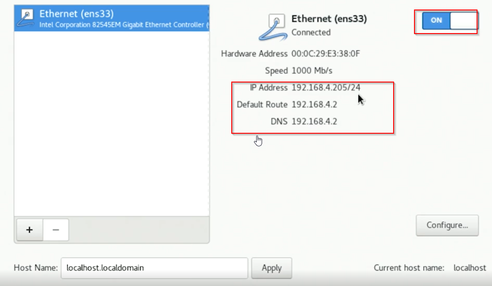
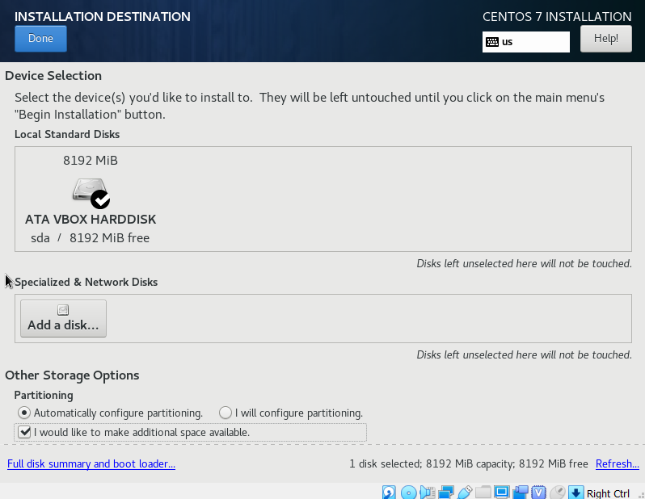
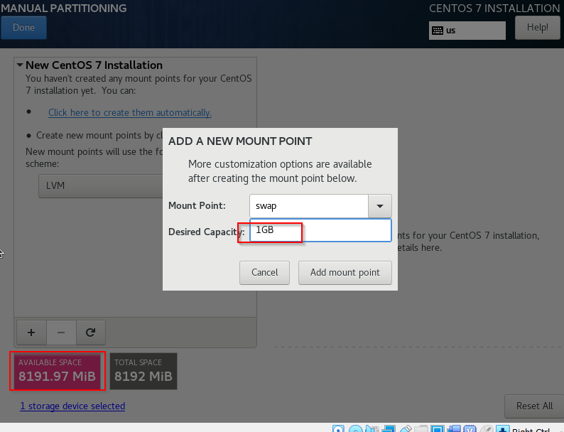
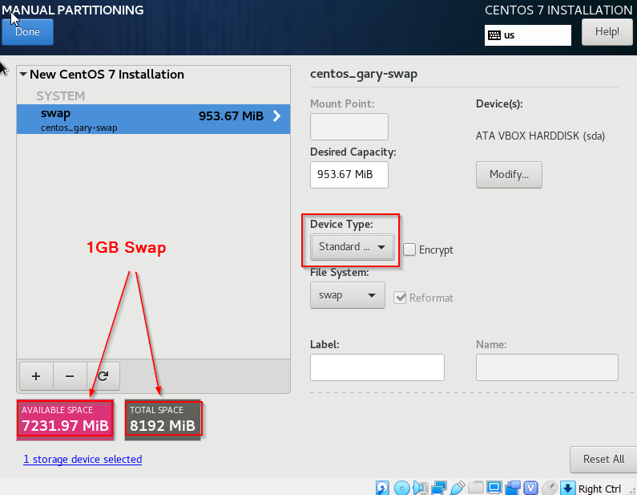
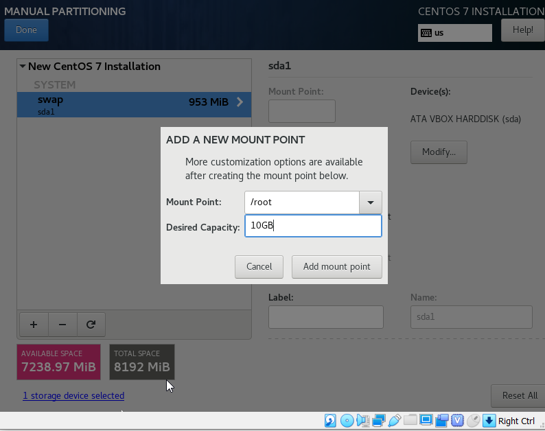
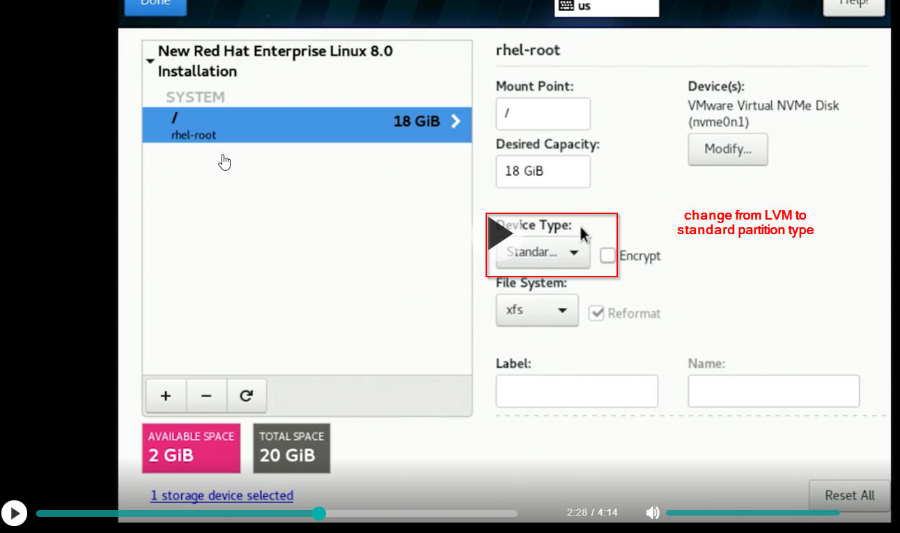
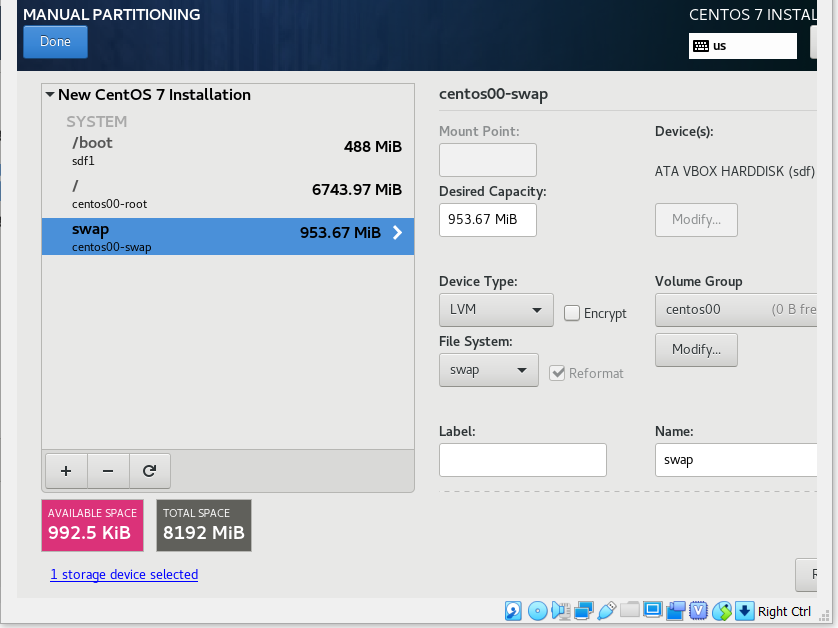
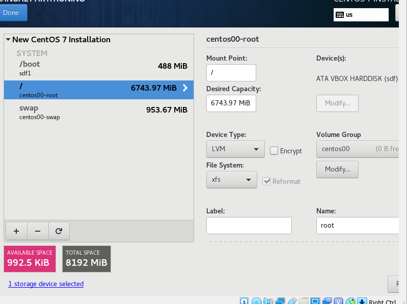
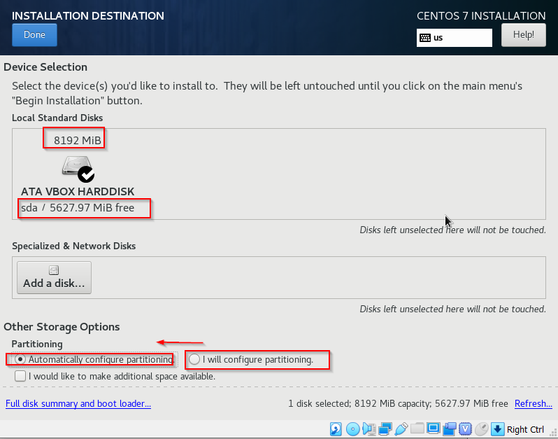

# 1-Install RedHat

## configure networking to contact a DHCP server


## configure partitions
1. select **custom**   

2. swap partition  

3. swap partition type  
> filesystem: **swap**  

4. root partition  

5. root partition type  
> filesystem: **xfs**  

6. swap summary  

7. root summary  

8. partition complete  


# 2-Login
> For newly built system, use **su -* to open root shell to add admin into wheel group, then admin can use **sudo -i** to become superuser
## su -
```
## open new shell for root, enter root password
$su -
Password: 
Last failed login: Fri Feb 12 23:04:00 EST 2021 on pts/1
There was 1 failed login attempt since the last successful login.
[root@garyhost ~]# 

```
## sudo -i
```
## as per sudo rule, enter user own password to become superuser
$sudo -i
[sudo] password for tichen: 
$
```
